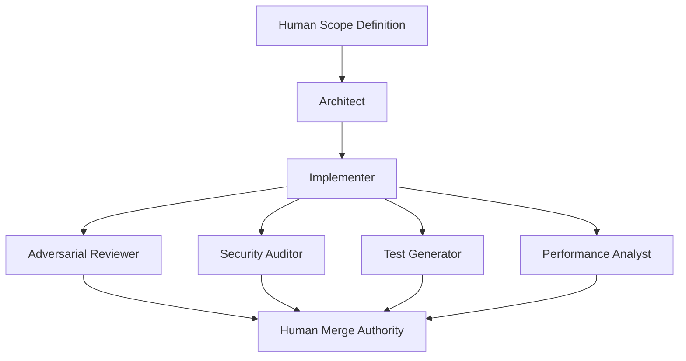

# Ensemble Software Engineering
### A Role-Specialized Framework for AI-Assisted Development

**William Parris**

## Abstract

Most AI-assisted development workflows use a single model to ideate, implement, review, and validate code. That structure is fundamentally risky: the same reasoning process is allowed to approve itself. This paper proposes Ensemble Software Engineering (ESE), a lightweight framework that distributes development across specialized roles (Architect, Implementer, Adversarial Reviewer, Security Auditor, Test Generator, Performance Analyst) while preserving human authority over risk acceptance and merging.

## 1. Introduction

Large language models have become capable programming assistants. Yet developers often prompt one model to generate code and then ask it to verify that its own output is correct.

ESE introduces structural separation: different intelligences are assigned different responsibilities. The result is structured disagreement and reduced self-confirmation bias.

## 2. The Problem of Self-Confirming AI Development

### Confirmation bias
When a model invents a wrong assumption, it can rationalize it during review.

### Hidden security and test gaps
Security flaws and edge cases emerge from the same simplifying assumptions that a single model is most likely to repeat.

### Lack of adversarial pressure
Good engineering depends on reviewers who actively try to break designs. Single-model development collapses that diversity of thought.

## 3. ESE

### Core pipeline

Each stage produces a structured artifact that feeds downstream roles.

## 4. Role specialization

**Architect** defines structure, interfaces, constraints, and non-goals.

**Implementer** produces code that aligns with the architecture.

**Adversarial Reviewer** stresses assumptions and hunts for edge cases and missing tests.

**Security Auditor** evaluates threat surface, misuse paths, and data exposure risk.

**Test Generator** creates deterministic tests that pin behavior to requirements.

**Performance Analyst** evaluates scaling limits, concurrency risks, and resource constraints.

## 5. Human authority

Humans retain merge authority and risk acceptance. ESE is decision-support, not autonomous control.

## 6. CI/CD integration

ESE integrates cleanly as a pull-request gate. The pipeline runs on PR, generates artifacts, and blocks merge on critical severity.

## 7. Future work

Future work includes measuring defect reduction, exploring ensemble diversity effects, and optimizing orchestration.

## 8. Conclusion

ESE offers an operationally lightweight way to bring separation-of-responsibility into AI-assisted development. No single intelligence should be allowed to certify its own work.
