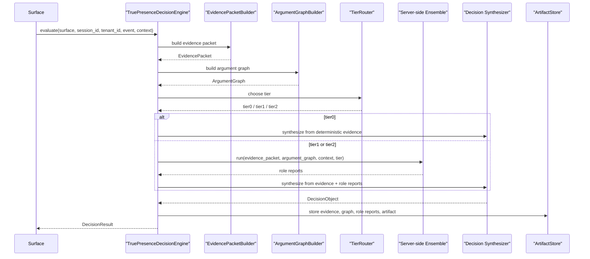

# TruePresence Decision Engine

## Purpose

The canonical decision engine exists to give every TruePresence surface one narrow product contract for trust evaluation. Surfaces normalize events and call the engine. The engine owns evidence construction, temporal reasoning, tier routing, server-side ensemble execution, final decision synthesis, and artifact emission.

## Canonical interface

```python
class TruePresenceDecisionEngine:
    def evaluate(
        self,
        surface: str,
        session_id: str,
        tenant_id: str,
        event: dict,
        context: dict | None = None,
    ) -> DecisionResult:
        ...
```

`DecisionResult` must include:
- `decision`
- `evidence_packet`
- `argument_graph`
- `decision_artifact`

## Input contract

Inputs:
- `surface`: canonical surface name such as `telegram` or `web_guard`
- `session_id`: per-session identity for temporal memory and artifact linkage
- `tenant_id`: tenant boundary for policy and enforcement logic
- `event`: normalized surface event
- `context`: optional supplemental context including history, challenge state, identity references, risk or policy data

## Output contract

Outputs:
- `decision`: canonical `DecisionObject`
- `evidence_packet`: canonical `EvidencePacket`
- `argument_graph`: canonical `ArgumentGraph`
- `decision_artifact`: structured artifact for audit and persistence

## Sequence



## Roles

The canonical engine expects server-side role reports from the ensemble runtime. Current roles include:
- liveness
- adversarial
- mediation
- relay
- reasoning_integrity_reviewer

The `reasoning_integrity_reviewer` is a product-facing reviewer role that checks whether conclusions actually follow from the evidence packet and argument graph.

## Tier router behavior

Tier 0 handles deterministic or policy-hardcoded blatant violations and still emits all artifacts.

Tier 1 is the standard server-side ensemble path.

Tier 2 is for ambiguous, high-risk, or high-value flows that need stronger escalation and review posture.

## Decision states

Canonical decision states:
- `ALLOW`
- `OBSERVE`
- `ELEVATED_OBSERVE`
- `CHALLENGE`
- `STEP_UP_AUTH`
- `RESTRICT`
- `BLOCK`
- `EJECT`

## Reason code catalog

V1 reason codes:
- `INVALID_ATTESTATION`
- `KNOWN_AUTOMATION_FINGERPRINT`
- `IMPOSSIBLE_EVENT_SEQUENCE`
- `CHALLENGE_FAILURE_DETERMINISTIC`
- `TIMING_AUTOMATION_PATTERN`
- `CROSS_SESSION_CLUSTER_MATCH`
- `EXCESSIVE_ROLE_DISAGREEMENT`
- `HIGH_VALUE_TRANSACTION_ESCALATION`
- `POLICY_REQUIRES_STEP_UP`
